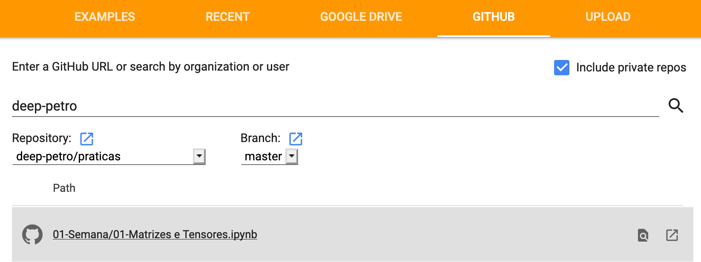

|-------------------------|---------------------------|----------------------------------|----------------------|
| [Logística](#logistica) | [Calendário](#calendario) |  [Executanto Notebooks](#collab) | [Projetos](#projeto) |

# Aprendizado Profundo

Aprendizado  de  Máquina  compreende  uma  subárea  da  Inteligência  Artificial  na qual  a  modelagem  de  um  problema  e  suas  respectivas regras  e  hipóteses são aprendidas  de  forma  automática  a  partir  dos  dados  disponíveis.  Esse  tipo  de abordagem  tem  ganho  força  em  diversas  áreas  como  biologia,  neurociências, controle  de  tráfego,  indústria  automobilística  e,  mais  recentemente,  geociências. O objetivo do curso aqui descrito é na exploração de sub-área de aprendizado denominada de Aprendizado Profundo (Deep Learning).

<a name="logistica"/>

## Logística de Aulas 

**Sala 2016 - ICEX**

|  Hora  |  Atividade        |
|--------|-------------------|
| 8-10h  | Teoria            |
| 10-12h | Exercícios        |
| 13-15h | Prática           |
| 15-17h | Invertida/Dúvidas |

<a name="calendario"/>

## Calendário 

Todos os slides estão [aqui](https://drive.google.com/open?id=1QWiiflLa-HnyUAfa4AZZhMIijQtJg_TV). Notebooks [aqui](https://github.com/deep-petro/praticas). Separados por semana abaixo.

### Semana 01: Introdução às Redes Neurais

1. [Slides](https://drive.google.com/open?id=1gTc_K88wXykryTZ-ljCnOd6pd07FV272)
1. [Exercícios](https://drive.google.com/drive/folders/1xt1TsHtVP6E7tn4n_VjOkTIytRaCnpqv?usp=sharing)
1. [Prática](https://github.com/deep-petro/praticas/tree/master/01-Semana)

|  Dia   |  Tópico                              | Invertida                 |
|--------|--------------------------------------|---------------------------|
| 24/06  | Motivação e Perceptron               | Apresentação              |
| 25/06  | Regressão Logística                  | Dúvidas de Cálculo        |
| 26/06  | Gradiente Descendente e Newton       | Dúvidas de Álgebra Linear |
| 27/06  | Backpropagation                      | Dúvidas de Programação    |

### Semana 02: Perceptrons de Múltiplias Camadas e Otimização

1. [Slides](https://drive.google.com/open?id=1csk3g_a_0k-SkDc2-EGiJBRfPpgXIQaS)
1. [Exercícios](https://drive.google.com/open?id=1JkdTpH4bCB6zoRF7-9P7e9sUg3KzUa_9)
1. [Prática](https://github.com/deep-petro/praticas/tree/master/02-Semana)

|  Dia   |  Tópico                              | Invertida                 |
|--------|--------------------------------------|---------------------------|
| 01/07  | Melhorias em Backpropagation         | Dúvidas Semana Anterior   |
| 02/07  | Regularização                        |                           |
| 03/07  | Funções de Perda                     | Visita e Discussões       |
| 04/07  | Grafos Computacionais e Prática      | Visita e Discussões       |

### Semana 03: Redes com Convoluções

1. [Slides](https://drive.google.com/open?id=1VZM24T5sxsfOdtBoCdFv_K5mL85ZLtKb)
1. [Exercícios](https://drive.google.com/open?id=1YtcvnoJ2VkQRQK30A2mnQA7FS8sWK7AU)
1. [Prática](https://github.com/deep-petro/praticas/tree/master/03-Semana)

|  Dia   |  Tópico                                   | Invertida                 |
|--------|-------------------------------------------|---------------------------|
| 08/07  | Convoluções, Padding e Pooling            | Dúvidas Semana Anterior   |
| 09/07  | Dilated, Separate e Decompositions        |                           |
| 10/07  | Classificação com Arquiteturas Profundas  |                           |
| 11/07  | CNNs na Prática (Vanishing etc)           |                           |

### Semana 04: Visão

1. [Slides](https://drive.google.com/open?id=1d-4Sct7RdcQ8j995woj9ie3bNyOxQehj)
1. [Exercícios](https://drive.google.com/open?id=1YEx4F7MjguNnl0gat-X4_3wLDISiXbZJ)
1. [Prática](https://github.com/deep-petro/praticas/tree/master/04-Semana)

|  Dia   |  Tópico                                                                                     | Invertida                 |
|--------|---------------------------------------------------------------------------------------------|---------------------------|
| 15/07  | Object {localization, detection}, R-CNNs, Convolutional implementation of sliding windows   | Dúvidas Semana Anterior   |
| 16/07  | Bounding box predictions, Intersection over union, Non-max supression, Anchor boxes, YOLO   |                           |
| 17/07  | {Image, Instance} segmentation                                                              |                           |
| 18/07  | Face recognition, Siamese networks, neural style transfer                                   |                           |

### Semana 05: Aprendizado não Supervisionado

1. [Slides](https://drive.google.com/open?id=1SMOo-ps-otlNT1kIQOP6OGDCYq6HAZE4)
1. [Exercícios](https://drive.google.com/open?id=1SMOo-ps-otlNT1kIQOP6OGDCYq6HAZE4)
1. [Prática](https://github.com/deep-petro/praticas/tree/master/05-Semana)

|  Dia   |  Tópico                   | Invertida                 |
|--------|---------------------------|---------------------------|
| 22/07  | Classical Auto Enconder   | Dúvidas Semana Anterior   |
| 23/07  | Variational Auto Encoder  |                           |
| 24/07  | GANs                      |                           |
| 25/07  | Modern GANs               |                           |

### Semana 06: Redes Recorrentes

1. [Slides](https://drive.google.com/open?id=11TsOfVLVkxD_Kb0EcqtOBequl05L-0T3)
1. [Exercícios](https://drive.google.com/open?id=11TsOfVLVkxD_Kb0EcqtOBequl05L-0T3)
1. [Prática](https://github.com/deep-petro/praticas/tree/master/06-Semana)

|  Dia   |  Tópico                   | Invertida                 |
|--------|---------------------------|---------------------------|
| 29/07  | Unfolding e RNNs          | Dúvidas Semana Anterior   |
| 30/07  | Deep RNNs                 |                           |
| 31/07  | GRUs e LSTMs              |                           |
| 01/08  | SEQ2SEQ e Attention       |                           |

### Semana 07: Processamento de Linguagem e Sequências

1. [Slides](https://drive.google.com/open?id=1QWiiflLa-HnyUAfa4AZZhMIijQtJg_TV)
1. **Exercícios focado nos Projetos**
1. **Prática focada nos Projetos**

|  Dia   |  Tópico                                                                       | Invertida                 |
|--------|-------------------------------------------------------------------------------|---------------------------|
| 05/08  | Learning word embeddings, word2vec, negative sampling, GloVe                  | Dúvidas Semana Anterior   |
| 06/08  | Sentiment, Debiasing, Seq. to Seq. Models, Most Likely Sentence, Beam Search  |                           |
| 07/08  | {Refinements, Error Analysis} of Beam Search, BLEU score                      |                           |
| 08/08  | Attention model, Speech Recognition                                           |                           |

### Semana 08: Deep Learning Research e Outros Tópicos

1. [Slides](https://drive.google.com/open?id=1PUdOQLQ69YgO1lFyAqo-eRIa-LjEU6jr)
1. **Exercícios focado nos Projetos**
1. **Prática focada nos Projetos**

|  Dia   |  Tópico                                        | Invertida                 |
|--------|------------------------------------------------|---------------------------|
| 12/08  | Concept Drift                                  | Apresentação Artigos      |
| 13/08  | Prunning e Understanding Deep Learning         | Apresentação Artigos      |
| 14/08  | Interpretability                               | Apresentação Artigos      |
| 15/08  | Modern Architectures (BERT, VID2VID, GraphNet) | Apresentação Artigos      |

<a name="collab"/>

## Usando o Collab 

Durante as tarefas práticas vamos fazer uso do collab. O mesmo permite conectar com o Github
e executar notebooks do mesmo. Ao acessar o [Collab](https://colab.research.google.com/notebooks/welcome.ipynb#recent=true),
clique em Github. Após isto, coloque os dados do repositório como na figura abaixo.



Agora basta clicar em um notebook e executar as células! Muito do nosso material vai usar arcabouços como `mxnet`
e `pytorch`. Para instalar no collab execute na primeira célula:

```
!pip install mxnet-cu100==1.4.1
```

<a name="projeto"/>

## Projeto 

Em Breve.
